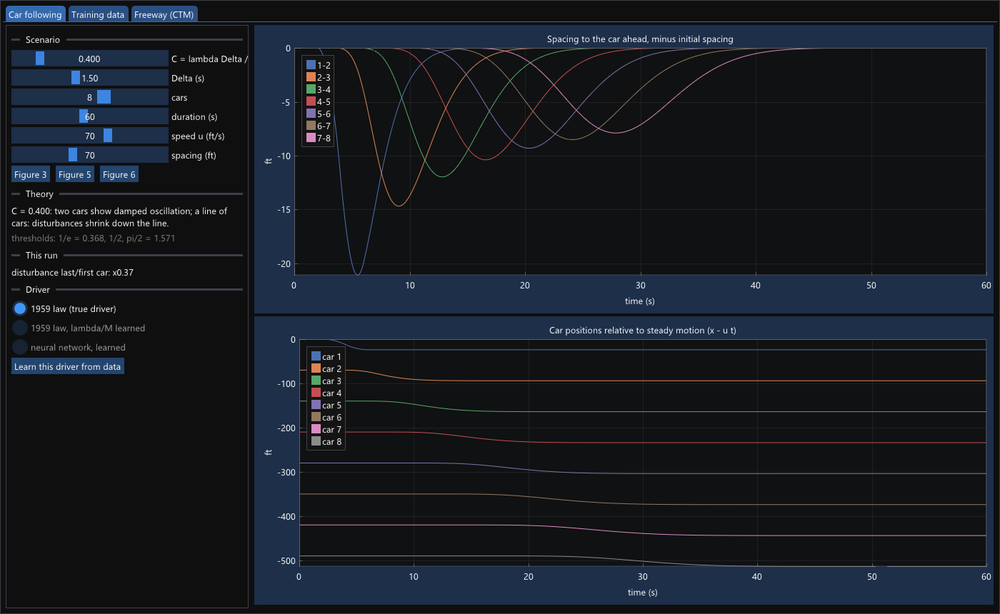
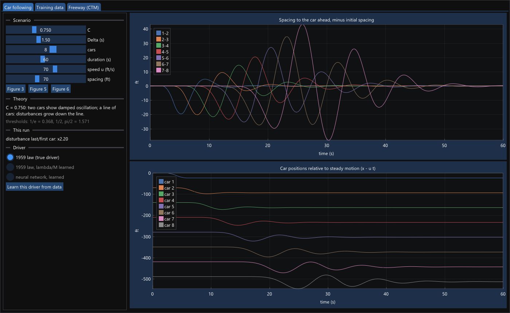
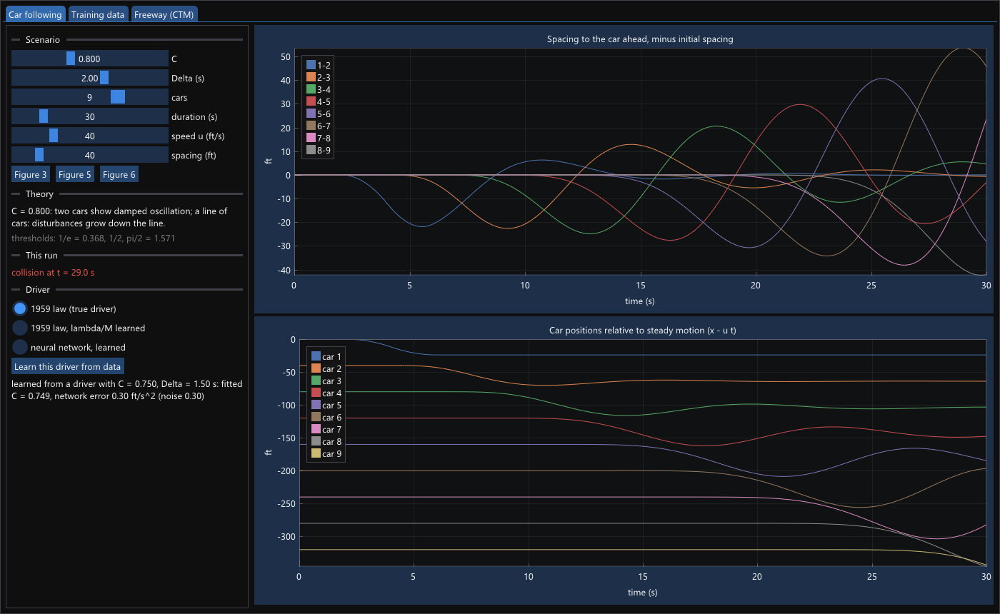
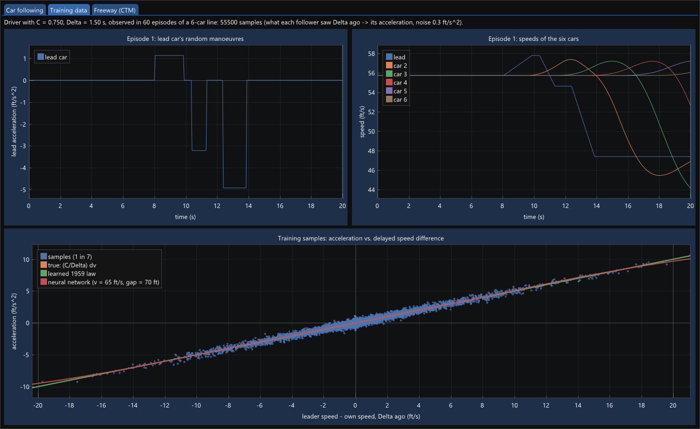
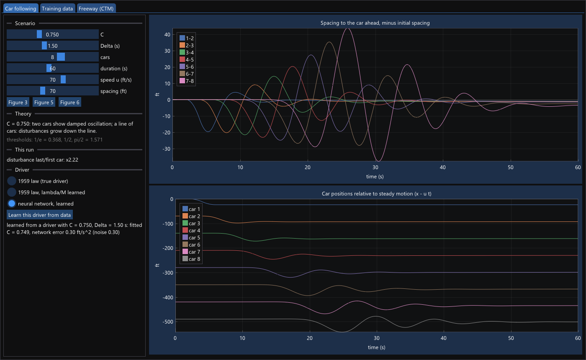

# Case Study: Stability in Car Following

Code: `examples/car_following/herman1959.hpp` (the simulator),
`examples/car_following.cpp` (the experiments). Tests:
`tests/test_car_following.cpp`.

This case study reproduces the numerical calculations of a classic paper of
traffic flow theory. It then asks a question that matters for data-driven
traffic models: **if a car-following law is learned from data, does it keep
the stability properties of the real drivers?**

> R. Herman, E. W. Montroll, R. B. Potts, R. W. Rothery (1959). Traffic
> dynamics: analysis of stability in car following. *Operations Research*
> 7(1), 86–106.

## The model

Each follower accelerates in proportion to how much faster its leader was
going, one reaction time Δ ago:

```
aₙ(t) = (λ/M) · [vₙ₋₁(t − Δ) − vₙ(t − Δ)]
```

Everything depends on one dimensionless number, **C = λΔ/M**:

| | condition | behaviour |
|---|---|---|
| local stability (two cars) | C < 1/e ≈ 0.368 | the spacing settles without oscillating |
| | C < π/2 ≈ 1.571 | oscillations die out |
| | C > π/2 | oscillations grow |
| asymptotic stability (a line of cars) | C < 1/2 | a disturbance shrinks from car to car |
| | C > 1/2 | it grows down the line |

The lead car brakes at 6 ft/s² for 2 s, then accelerates back to its speed.
The paper uses feet and seconds, and so does this chapter.

## The simulator

`simulate` follows the paper's numerical scheme: explicit Euler with
dt = 0.01 s, the delay counted in whole steps, and followers holding their
initial speed until the first delay has passed. The car-following law is a
plug-in:

```cpp
using Follower = std::function<void(std::span<const Stimulus>, std::span<double>)>;
struct Stimulus { double dv, v, gap; };   // what a follower saw Delta ago

inline Follower linear_follower(double lambda_m) {
    return [lambda_m](std::span<const Stimulus> s, std::span<double> a) {
        for (std::size_t j = 0; j < s.size(); ++j) a[j] = lambda_m * s[j].dv;
    };
}
```

It works on all followers at once, so a neural network can evaluate the
whole line of cars in one forward pass.

`tests/test_car_following.cpp` checks the theory: every regime of the table
above, the ½ threshold of asymptotic stability, and the collision of
Figure 6.

## Part 1: the paper's figures

`car_following` writes each figure as a CSV file (`fig3.csv` …
`fig6.csv`) and prints what it shows:

```
Figure 4: two cars, spacing after the lead car's manoeuvre (40 s)
       C  simulation              crossings   growth   theory
    0.50  damped oscillation              1     0.00   damped oscillation
    0.80  damped oscillation              4     0.00   damped oscillation
    1.57  damped oscillation             12     0.96   damped oscillation
    1.60  oscillation grows              12     1.16   oscillation grows

Figure 5: 8 cars, largest spacing disturbance of each follower (ft)
  C = 0.368:  21.3  14.1  11.2   9.6   8.5   7.8   7.2   last/first 0.34
  C = 0.500:  20.6  16.4  14.5  13.3  12.4  11.8  11.3   last/first 0.55
  C = 0.750:  19.6  20.2  21.6  23.3  27.0  34.6  43.2   last/first 2.20

Figure 6 (9 cars, C = 0.8, Delta = 2 s): first collision at t = 29.02 s
```



*C = 0.40, below ½. Each follower's spacing error is smaller than the one
ahead of it (screenshot from [XiNN Lab](xinn-lab.md)).*



*C = 0.75, above ½. The same manoeuvre of the lead car grows from car to car:
the last follower's spacing error is 2.2 times the first one's.*

"Crossings" counts how often the spacing passes its initial value after the
manoeuvre. "Growth" compares the late oscillation with the early one. At
C = 1.57, just below π/2, the oscillation decays only slowly (×0.96). Just
above, at 1.60, it grows (×1.16).



*The paper's Figure 6: nine cars at 40 ft/s, C = 0.8 and Δ = 2 s. The
disturbance grows down the line until cars 8 and 9 collide at 29 s.*

At C = ½, the boundary of asymptotic stability, the disturbance still shrinks
along 8 cars (×0.55). The threshold is exact for an infinitely long line; for
a short one, the change is gradual.

## Part 2: learning drivers from trajectories

For each C of the figures, the example **observes** a driver:

- 60 short episodes of a 6-car line with random speeds and spacings;
- a lead car that brakes and accelerates at random, to excite the dynamics;
- the follower's acceleration, measured with noise of 0.3 ft/s².

Each record pairs what the follower saw Δ ago (Δv, v, gap) with its
acceleration now. That is what one gets from vehicle trajectories, such as
drone or NGSIM data, once the reaction time is known.



*What a learned driver is trained on, for a driver with C = 0.75. Top: one of
the 60 episodes, with the lead car's random manoeuvres and the responses of
the six cars. Bottom: 1 in 7 of the 55,500 samples, with the true response
(C/Δ)·Δv, the fitted 1959 law and the neural network drawn over them. The
three lines lie on top of each other.*

Two models learn from the records:

```cpp
// The 1959 law with its single parameter learned.
struct LinearDriver : Module {
    Param<double, 0> lambda_m{Scalar<double>(Shape<0>{}, 0.1)};
    auto forward(const auto& dv) const { return dv * lambda_m; }
};

// A network that knows nothing about car following.
struct NeuralDriver : Module {
    Dense<{.activation = Activation::tanh}, double> fc1, fc2;
    Dense<{}, double> out;
    auto forward(const auto& x) const { return out(fc2(fc1(x))); }   // (dv, v, gap) -> a
};
```

The trained network becomes a `Follower`, so the simulator runs it in closed
loop. Each step, the delayed stimuli of all followers go through the network
in one batch, and its outputs are the accelerations.

## Results

```
scenario             C |   C fit  NN rmse | true driver              | fitted 1959 model        | neural network
Fig 4, two cars  0.500 |   0.500     0.30 | damped oscillation       | damped oscillation       | damped oscillation
Fig 4, two cars  0.800 |   0.800     0.30 | damped oscillation       | damped oscillation       | damped oscillation
Fig 4, two cars  1.570 |   1.570    10.11 | damped oscillation (x0.96) | damped oscillation (x0.96) | damped oscillation (x0.99)
Fig 4, two cars  1.600 |   1.600    10.25 | oscillation grows (x1.16)  | oscillation grows (x1.16)  | oscillation grows (x1.26)
Fig 5, 8 cars    0.368 |   0.368     0.30 | last/first 0.34 (shrinks) | last/first 0.34 (shrinks) | last/first 0.33 (shrinks)
Fig 5, 8 cars    0.500 |   0.499     0.30 | last/first 0.55 (shrinks) | last/first 0.54 (shrinks) | last/first 0.55 (shrinks)
Fig 5, 8 cars    0.750 |   0.750     0.30 | last/first 2.20 (grows)   | last/first 2.20 (grows)   | last/first 2.18 (grows)
Fig 6, 9 cars    0.800 |   0.800     0.30 | collision at 29.0 s      | collision at 29.0 s      | collision at 29.1 s
```

`C fit` is the learned λ/M times Δ. `NN rmse` is the network's training
error in ft/s². The measurement noise alone is 0.30, so 0.30 is a perfect
fit.



*The same scenario as above, driven by the neural network. The disturbance
grows ×2.22, against ×2.20 for the true driver.*

**Both learned models reproduce every stability regime**: the damped and
growing oscillations of two cars, the disturbance that shrinks or grows down
a line, and the collision of Figure 6. The instability belongs to the
driving behaviour, and a model that learns the behaviour learns the
instability with it.

Three lessons:

- **With the right model form, 3 decimals come for free.** The 1959 law has
  one parameter, and 50,000 noisy records pin it down exactly. The network
  needs about a thousand weights to say the same thing.
- **Near a stability boundary, small errors matter.** For drivers close to
  C = π/2 the training data contain large, growing oscillations. The network
  fits them less well (10 ft/s²), and its closed-loop behaviour lands closer
  to the boundary: ×0.99 against the true ×0.96, and ×1.26 against ×1.16. A
  model can fit well on average and still misjudge stability, because
  stability depends on the model's *gain*, the slope ∂a/∂Δv, and not on its
  average error.
- **Test learned models in closed loop.** A good training error says that
  one-step predictions are right. Stability is a property of the model fed
  its own outputs, step after step, down a line of cars. Only a closed-loop
  simulation shows it.

## Exercises

1. Read off the network's gain: evaluate it at Δv = ±1 ft/s with v and gap
   fixed, and compute `C = gain · Δ`. How close is it to the true C, for each
   driver?
2. Train the network on a *stable* driver (C = 0.4) but only on episodes with
   small disturbances (|Δv| < 3 ft/s). Run it in the Figure 5 scenario. What
   happens when the line meets disturbances larger than those in training?
3. Add a nonlinear driver, e.g. `a = λ/M · Δv / gap` (the Gazis–Herman–Potts
   form), and learn it with both models. Which one can represent it?
4. Plot `fig5_C0.750.csv`, spacing against time for each pair, and compare
   it with the paper's Figure 5.
