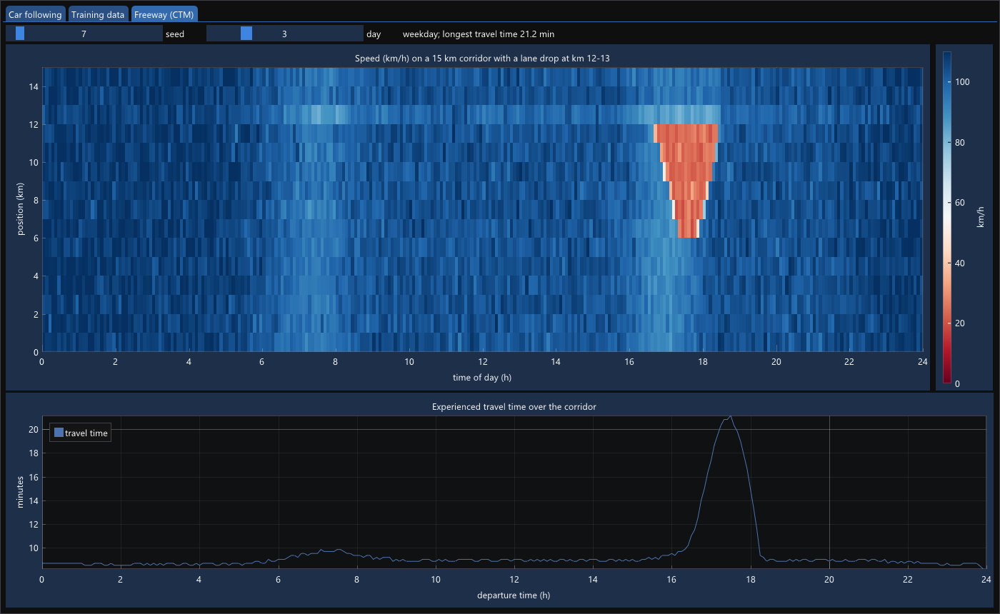

# 5. Training

Code: `include/xinn/optim.hpp`, `data.hpp`, `metrics.hpp`, `datasets.hpp`,
weighted targets in `loss.hpp`. Traffic simulator: `examples/traffic/ctm.hpp`.
Tests: `tests/test_train.cpp`, `tests/test_ctm.cpp`. Examples:
`examples/mnist_mlp.cpp`, `traffic_state.cpp`, `travel_time.cpp`. Data:
`python tools/prepare_data.py`.

## 5.1 The training loop

Every example in this chapter trains the same way:

```cpp
Adam opt(net, {.lr = 1e-3});
for (std::size_t epoch = 0; epoch < epochs; ++epoch)
    for (auto [xb, yb] : batches(x_train, y_train, 128, rng)) {
        opt.zero_grad();
        backward(softmax_cross_entropy(net(xb), yb));
        opt.step();
    }
```

An **epoch** is one pass over the training data. Each pass is cut into
shuffled **mini-batches**. A gradient from 128 samples is noisy, but it is
cheap, so an epoch yields hundreds of useful steps instead of one exact one.
The noise also helps: it keeps the optimizer from settling in sharp minima
that do not generalize.

`batches` is a **coroutine**. C++23's `std::generator` produces values
lazily: the loop body runs between two `co_yield`s.

```cpp
inline std::generator<std::span<const std::size_t>> shuffled_batches(std::size_t n, std::size_t batch, Rng& rng) {
    std::vector<std::size_t> order(n);
    std::iota(order.begin(), order.end(), std::size_t{0});
    std::ranges::shuffle(order, rng);
    for (std::size_t start = 0; start < n; start += batch)
        co_yield std::span<const std::size_t>(order).subspan(start, std::min(batch, n - start));
}
```

The shuffled order lives inside the coroutine frame for as long as the loop
runs. No iterator class has to be written.

## 5.2 Optimizers

**SGD with momentum.** `v ← μv + g`, then `p ← p − lr·v`. The velocity `v`
averages recent gradients, so steps keep their direction through bumps and
speed up along long, shallow valleys.

**Adam.** Adam keeps running averages of the gradient `m` and of its square
`v`, and steps by `m / √v`:

```
m ← β₁m + (1 − β₁)g          v ← β₂v + (1 − β₂)g²
p ← p − lr · (m / (1 − β₁ᵗ)) / (√(v / (1 − β₂ᵗ)) + ε)
```

Dividing by `√v` gives each parameter its own step size. The `1 − βᵗ`
factors correct the zero start of `m` and `v`. The test
`adam_first_step_is_lr_times_sign` checks a consequence: the first step is
exactly `lr` in the direction of `−sign(g)`. With `weight_decay`, XiNN
applies decoupled decay (AdamW): `p ← p − lr·wd·p`, separate from the
gradient.

**State laid out from the model type.** An optimizer needs one or two
tensors of state per parameter, each with that parameter's shape. XiNN
derives the layout from the model's type:

```cpp
template <class X>
auto param_tuple(X& x) {                       // in module.hpp
    if constexpr (is_param_v<X>) return std::tuple<X>{x};
    else if constexpr (ModuleType<X>)
        return [&]<std::size_t... I>(std::index_sequence<I...>) {
            return std::tuple_cat(param_tuple(x.[:members_of<X>()[I]:])...);
        }(std::make_index_sequence<members_of<X>().size()>{});
    else return std::tuple<>{};
}

template <ModuleType M>
Adam(M&, AdamOptions = {}) -> Adam<params_of_t<M>>;   // deduction guide
```

`Adam opt(net)` therefore has type
`Adam<std::tuple<Param<float, 2>, Param<float, 1>, ...>>`. Its moments are a
matching tuple of tensors, and `step()` is a `template for` over the tuple.
There are no maps from names to state, and no type erasure.

One GCC detail is worth noting. The member list is looked up *inside* the
splice, `members_of<X>()[I]`, and not captured by the lambda. A lambda that
captures a compile-time-only value such as a reflection becomes compile-time
only itself, and could then not touch the run-time object `x`.

**Strategy.** The `Optimizer` concept names what a training loop needs:
`step()`, `zero_grad()`, and getting and setting the learning rate. Any type
that provides them plugs in; there is no base class.

**Schedules.** `cosine_lr(step, total, lr0, lr_min)` starts at `lr0` and
decays smoothly to `lr_min`: large steps early, fine steps at the end.

## 5.3 Preparing data

Three rules apply to all the examples.

- **Standardize features**, to mean 0 and standard deviation 1 per column.
  Flow in veh/h (≈ 5000) and occupancy (≈ 0.1) differ by five orders of
  magnitude. Unscaled, one learning rate cannot suit both.
- **Fit the scaling on training data only**, then apply the same numbers to
  test data. `Standardizer::fit` returns the means and scales;
  `operator()` applies them lazily as `(x − mean) / scale`.
- **Split time series by time**, never at random. Neighbouring 5-minute
  intervals are nearly identical. A random split would test on near-copies
  of the training samples. The traffic examples train on the first 80% of
  days and test on the rest.

The loaders return `std::expected`, like `load` in chapter 4. The MNIST
reader converts its big-endian header fields with C++23 `std::byteswap`.

## 5.4 MNIST

`examples/mnist_mlp.cpp` trains 784 → 256 → 128 → 10 (235,146 parameters)
with Adam, batches of 128 and a cosine schedule. Release build, one CPU
thread:

```
epoch 1  loss 0.2577  test accuracy 96.50%  (4.1 s)
epoch 3  loss 0.0602  test accuracy 97.75%  (3.6 s)
epoch 5  loss 0.0325  test accuracy 98.02%  (3.7 s)
```

98% is typical for a network of this kind. Getting much further needs
convolutions (chapter 8). The confusion matrix shows the usual mistakes:
4 ↔ 9, 3 ↔ 5, 7 → 2.

## 5.5 Traffic data

**Synthetic: a Cell Transmission Model.** `examples/traffic/ctm.hpp`
simulates a 15 km, 3-lane freeway with a lane drop to 2 lanes at km 12–13.
The CTM (Daganzo, 1994) is the discrete form of the LWR kinematic-wave
model. The road is cut into cells of length `vf·Δt`, and each step moves

```
flow into cell i = min(sending(i − 1), receiving(i))
```

vehicles across each cell boundary. The fundamental diagram has a curved
free-flow branch: speed falls from 110 km/h on an empty road to 85 km/h at
capacity (2000 veh/h/lane). The congested branch is straight, with jam
density 120 veh/km/lane and a backward wave speed of 20.7 km/h. Queues form
at the lane drop, and their tails move upstream at the shockwave speed, all
from the one flow rule.

Each simulated day has random demand with morning and evening peaks, lower
demand at weekends, an incident on a quarter of the days, and a 7% capacity
drop when a queue discharges. Detectors every kilometre report 5-minute flow,
occupancy and speed, with measurement noise. Traced vehicles give each
departure's **experienced** travel time. `tests/test_ctm.cpp` checks the
physics:

- light traffic crosses in about the free-flow time
- the two branches of the diagram meet at capacity
- queues form upstream of the lane drop on some days but not all
- traffic past the drop stays fast (≥ 87 km/h)

Building the simulator took three rounds, each fixing a flaw that the data
exposed:

1. The road started empty at midnight, so the first interval reported
   nonsense speeds. It now warms up for an hour first.
2. Queues filled the whole corridor, so travel times hit a ceiling. The
   corridor is now longer, the peaks lower, and waiting at the entrance
   counts.
3. The triangular diagram kept speed at exactly vf until capacity, so a
   "slowing" state never occurred. Real detectors show speed falling
   gradually, so the free-flow branch is now curved.



*One simulated weekday, seen in [XiNN Lab](xinn-lab.md). The evening queue
forms at the lane drop (km 12), its tail travels upstream to km 6 at the
shockwave speed, then the queue dissolves. Below: each departure's
experienced travel time, up to 21 minutes against 8.2 in free flow.*

**Real: PEMS08.** Caltrans PeMS data from District 8 (San Bernardino),
July–August 2016: 170 loop detectors, 17,856 five-minute intervals, with
flow, occupancy and speed. It is the version published with the ASTGCN and
ASTGNN papers. `tools/prepare_data.py` downloads it and converts it to raw
`float32`. The examples convert it to the simulator's units: veh/h and
km/h.

**What PEMS08 cannot do.** It comes with a detector graph, but it is not a
corridor. Speeds of neighbouring detectors along the longest path are barely
correlated (0.02–0.5), no more than those of random pairs. Some detectors
report identical series, a sign of imputed data. So PEMS08 serves the
per-detector task below, but not corridor travel time.

## 5.6 Predicting the traffic state

**Task.** From the last 30 minutes at a detector (flow, occupancy and speed,
six intervals each) and the time of day, predict the state 15, 30 or 60
minutes ahead:

| State | Speed |
|---|---|
| free | ≥ 88 km/h (55 mph) |
| slowing | 64–88 km/h |
| congested | < 64 km/h (40 mph) |

**Baseline: persistence.** "The state then equals the state now." Traffic
changes slowly, so this is hard to beat at short horizons. Any claim of
improvement must be made against it.

**Class imbalance.** On PEMS08, 94% of the samples are *free*. Plain
cross-entropy learns mostly to say *free*: accuracy looks excellent, and
congestion, the class that matters, is detected no better than by
persistence. The remedy is **class weights**. A sample of a rare class counts
more in the loss. XiNN puts the weight into the target row, so one-hot
becomes `[0, 0, w]`, and generalizes the fused loss:

```
loss_row = (Σⱼ tⱼ) · log Σₖ exp xₖ − Σⱼ tⱼ xⱼ        ∂/∂x = (softmax(x) · Σⱼ tⱼ − t) / n
```

`balanced_class_weights` gives every class the same total weight. The
example uses the **square root** of those weights, a middle way.

**Results** (test days only; "network" is plain cross-entropy, "weighted"
uses √balanced weights):

*Synthetic corridor:*

| ahead | accuracy: persist / network / weighted | macro F1 | congested F1 |
|---|---|---|---|
| 15 min | 99.01 / **99.23** / 98.71 | 0.736 / **0.793** / 0.742 | 0.738 / **0.754** / 0.679 |
| 30 min | 98.55 / **98.81** / 97.96 | 0.632 / **0.683** / 0.670 | 0.504 / **0.520** / 0.457 |
| 60 min | 97.87 / **98.61** / 96.70 | 0.473 / 0.513 / **0.588** | 0.212 / 0.174 / **0.309** |

*Real detectors (PEMS08):*

| ahead | accuracy: persist / network / weighted | macro F1 | congested F1 |
|---|---|---|---|
| 15 min | 96.92 / **97.14** / 96.37 | 0.803 / 0.806 / **0.807** | 0.803 / 0.807 / **0.812** |
| 30 min | 95.88 / **96.23** / 95.15 | 0.737 / 0.735 / **0.746** | 0.704 / 0.706 / **0.714** |
| 60 min | 94.57 / **95.30** / 93.67 | 0.659 / 0.651 / **0.678** | 0.573 / 0.583 / **0.589** |

What the tables say:

- **Persistence is strong.** At 15 minutes it is within a fraction of a
  point of the network everywhere.
- **Learning helps more the further ahead.** Persistence loses 2.4 points of
  accuracy between 15 and 60 minutes on PEMS08. The network loses 1.8.
- **Accuracy and rare-event detection pull apart.** Weighting costs about one
  point of accuracy, but gives the best macro-F1 on real data at every
  horizon. At 30 minutes it detects 74% of congested intervals, against 66%
  unweighted. Fully balanced weights (not shown) overshoot and raise 20,000
  false "slowing" alarms. Which trade-off is right depends on the cost of a
  missed jam against a false alarm, and that is an operational question, not
  a modelling one.

## 5.7 Predicting travel time

**Task.** A vehicle enters the 15 km corridor now. From the last 15 minutes
at all 15 detectors, predict its **experienced** travel time: the time it
will actually take, through traffic that changes while it drives.

**Baselines.** The **instantaneous** estimate, Σ (section length / current
speed), is what roadside signs typically show. It assumes traffic stays as
it is now. The **historical** estimate is the average at that time of day.

**Results** (16 test days, 4,576 departures, 158 of them in congestion):

| | MAE (min) | MAPE | MAE in congestion | MAPE in congestion |
|---|---|---|---|---|
| instantaneous | 0.14 | 1.5% | 1.20 | 9.4% |
| historical | 0.40 | 4.0% | 2.82 | 19.5% |
| **network** | **0.09** | **1.0%** | **0.75** | **5.3%** |

In congestion the network's error is 37% below the instantaneous estimate.
The traces show where the gain comes from, and where it ends:

```
recurring morning peak (no incident)          afternoon with an incident
 time  actual  instant.  network               time  actual  instant.  network
 7:05   10.8     9.6      9.9                 15:45   11.8     8.9      8.9
 7:20   13.5    12.0     13.2                 16:00   19.2    14.7      9.9
 7:35   15.7    15.1     15.6                 16:15   17.7    13.2     10.0
 8:05   14.3    14.9     13.7                 16:30   13.7    13.7     15.8
 8:20   10.0    12.6     10.3                 16:45   11.3    12.8     10.8
```

- **Recurring congestion:** the instantaneous estimate *lags*. It is too low
  while the queue grows and too high while it clears, because a vehicle
  meets a queue that has changed by the time it arrives. The network has
  learned how queues evolve and follows the actual time closely.
- **An incident:** nothing in the past 15 minutes announces it, and
  incidents are rare in the training data. Every predictor misses the onset,
  and the network misses worst: it expects the usual afternoon. A learned
  model is only as good as the situations it has seen.

**Real corridor data** needs detectors in order along one freeway, with
positions (see §5.5). The loader and features here are written so that such
a data set can replace the simulator. Doing this with Caltrans PeMS data is
the project at the end of this chapter.

## 5.8 Old C++ and new

| C++17 way | C++26 way in XiNN |
|---|---|
| iterator classes for batching | `std::generator` coroutines |
| optimizer state in a map keyed by name | a typed tuple laid out from the model by reflection |
| virtual `Optimizer` base class | the `Optimizer` concept |
| exceptions or error codes in loaders | `std::expected` |
| `ntohl` and friends | `std::byteswap` |
| loops over state with index recursion | `template for` over tuples |

## 5.9 Exercises

1. Add *Nesterov* momentum to `SGD`. Which line of `step()` changes?
2. Train `mnist_mlp` with SGD + momentum (lr 0.05, μ 0.9) instead of Adam.
   Compare the loss after one epoch.
3. In `traffic_state`, add the speeds of the detectors immediately upstream
   and downstream as features, for the synthetic corridor. Congestion travels
   upstream: does 60-minute prediction improve?
4. The incident trace shows a failure. Add an "incident" flag as an input,
   such as an operator would enter. How much of the error goes away?
5. Change the weight power in `traffic_state` (its command-line argument)
   from 0.5 to 0.25 and 0.75. Plot macro-F1 against accuracy.

### Project: travel time on a real corridor

Repeat §5.7 with real detector data from Caltrans PeMS.

**Get the data.** Register (free) at <https://pems.dot.ca.gov>. In the
*Data Clearinghouse*, pick one district and download:

- **Station 5-Minute** files for four to six weeks of one season.
- The **Station Metadata** file for the same district and period.

**Build the corridor.**

1. From the metadata, choose one freeway and direction, e.g. I-405 N, and a
   stretch of 10–20 km with a known bottleneck.
2. Keep its mainline stations (`Type == ML`), sorted by absolute postmile
   (`Abs_PM`, in miles).
3. Each station stands for the section halfway to its neighbours. Section
   lengths follow from the postmiles.

**Clean it.** Each 5-minute row has a `% Observed` column. Drop stations,
or days, where much of the data was imputed. Otherwise you learn PeMS's
imputation, not traffic (see §5.5). Fill short gaps by carrying the last
value forward.

**Compute the target.** PeMS has no travel times of individual vehicles.
Compute each departure's experienced time from the speed field: trace a
vehicle through the sections, using each section's speed *at the time the
vehicle reaches it*. This is the "trajectory method" that PeMS itself uses
for travel-time reports. It replaces the tracers of the simulator.

**Reuse the code.** Write a loader that fills the same (interval, detector,
[flow, occupancy, speed]) tensor that `traffic_state.cpp` uses. Then feed
`travel_time.cpp`'s `make_samples` from it in place of `simulate_days`. The
model, the training loop and the baselines need no change.

**Reference solution.** `examples/solutions/pems.hpp` reads both file
types, builds the corridor, fills gaps and computes experienced travel times.
`examples/solutions/pems_travel_time.cpp` is the whole experiment;
`tests/test_pems.cpp` tests it on small files in PeMS format. Try the project
before reading them. Run it as:

```
pems_travel_time META FWY DIR PM_FROM PM_TO FILE...
pems_travel_time data/pems/d12/d12_text_meta_2024_02_29.txt 405 N 0 12 data/pems/d12/d12_text_station_5min_2024_*.txt
```

**Questions.**

- Does the network still beat the instantaneous estimate on real data? By
  how much, in and out of congestion?
- Which days does it get most wrong? Check the PeMS incident records for
  those days.
- How does it compare with the synthetic corridor, and what does the
  simulator leave out?
